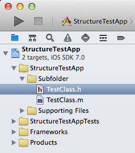
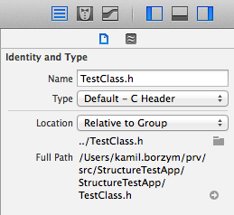
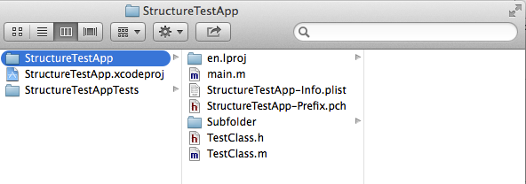
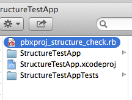
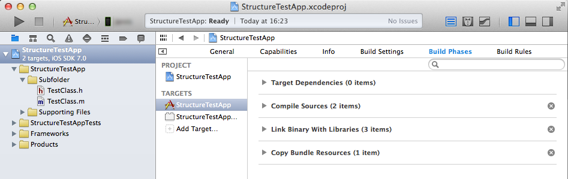
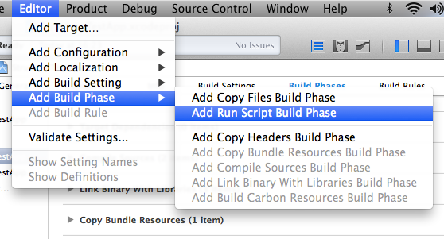
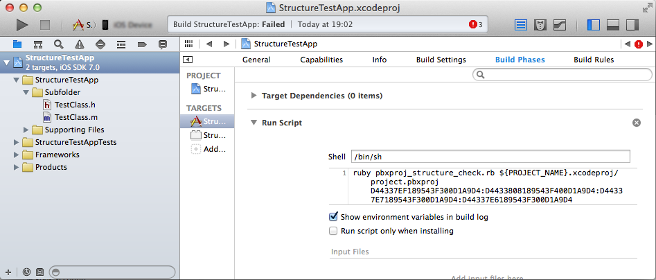
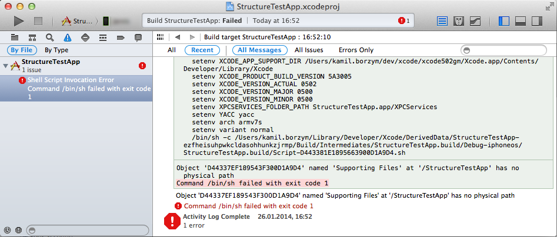

pbxproj structure check
=======================

Simple ruby script to check if a Xcode *.pbxproj file structure matches a project physical directory structure. It can be added as a build phase to warn you when your project structure loses its alignment.

Motivation
----------

History of some (if not any) Xcode developer :) You see some *TestClass* files in *Subfolder* group:

But you see something strange in file inspector! The *TestClass.[h|m]* files are not really located in *Subfolder* group :o

Using Finder you reveal horrible truth - *.pbxproj file and file system are misaligned!

Cocoa Pods
----------

pbxproj_structure_check can be integrated into your project using [CocoaPods](http://cocoapods.org). Add following entry to your Podfile:

	pod 'pbxproj_structure_check', '~> 1.0.2'

Then add a 'Run Script' build phase to your app target (see **Add to Xcode as Build Phase** for details). Type following as build phase script:

	ruby Pods/pbxproj_structure_check/pbxproj_structure_check.rb ${PROJECT_NAME}.xcodeproj/project.pbxproj

If you get an error from the script about some objects during build, you can ignore those errors by adding object ids joined by ':' at the end of script invocation.

For example: When you get errors about objects D497DE90182D2EFC00924692 and A497DE90182D2EFC00924692 and you would like to ignore those errors, use following invocation:

	ruby Pods/pbxproj_structure_check/pbxproj_structure_check.rb ${PROJECT_NAME}.xcodeproj/project.pbxproj D497DE90182D2EFC00924692:A497DE90182D2EFC00924692

Manual usage
------------

	$ ruby pbxproj_structure_check.rb 
	ruby pbxproj_structure_check.rb pbx_path [ignored_id:...]

Examples
--------

	$ ruby pbxproj_structure_check.rb /allignedProjectPath/allignedProject.xcodeproj/project.pbxproj
	$ echo $?
	0

	$ ruby pbxproj_structure_check.rb /otherProject/otherProject.xcodeproj/project.pbxproj
	Object 'D497DE90182D2EFC00924692' named 'Supporting Files' at '/otherProject' has no physical path
	$ echo $?
	1
	# I don't care about this object, let's ignore it :P
	$ ruby pbxproj_structure_check.rb /otherProject/otherProject.xcodeproj/project.pbxproj D497DE90182D2EFC00924692
	$ echo $?
	0

Add to Xcode as Build Phase
---------------------------

Let's integrate `pbxproj_structure_check.rb` with your project, so it be a defender of your project's alignment :)

First - copy `pbxproj_structure_check.rb` to your project root folder.

Select your project in Project Navigator, select your app target and choose **Build Phases** tab.

From menu bar choose **Editor**, **Add Build Phase** and **Add Run Script Build Phase**.

**Run Script** has been added, move it up, so it be placed below **Target Dependencies**. Type `pbxproj_structure_check.rb` invocation as script:

	ruby pbxproj_structure_check.rb ${PROJECT_NAME}.xcodeproj/project.pbxproj

Then you can specify ignored ids at the end of above invocation (e.g. ids of 'Frameworks', 'Products', etc.)	

If script detects any misaligned object during build - it reports an error.

**I would appreciate any suggestions!**
